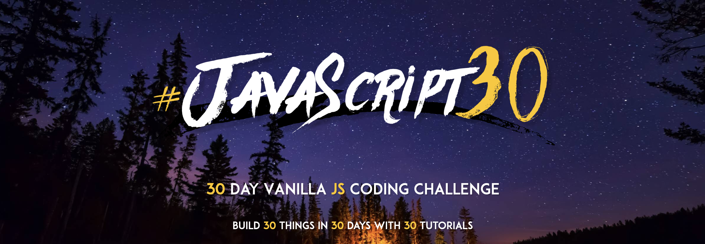

# JavaScript30

This repo contains solutions to 30 Days of Vanilla JavaScript challenges. Based on tutorials by [@wesbos](https://twitter.com/wesbos).

## Live Site Demo

[Live Site](https://zowdk.github.io/JavaScript30/index.html)

## Learning Objectives

- Not set up yet.

## Lesson Notes

 - Not set up yet. 

## Acknowledgements

- Big thanks to [@wesbos]("https://twitter.com/wesbos") for creating this course!
- Starter files were forked from the original [JavaScript 30 Repository]("https://github.com/wesbos/JavaScript30").
- You can find the full course at https://JavaScript30.com. It's free ✨
 
